# RESONANCE AI4D Lab website: assessment and recommendations

**Site reviewed:** <https://sites.google.com/aait.edu.et/resonance-lab/home> (all 9 pages)\
**When:** 3–4 October 2026\
**How:** Chrome at 1440 px (desktop) and 390 px (phone), Lighthouse 12, a manual accessibility pass, and a reading of the source of every page. All screenshots are of the live site as found.

---

## Summary

The lab has good material: a clear mission, four well-defined research themes and a detailed call for applications. **The way the site is built hides most of it.** Every content section is a Google Sites *Custom embed* (a separate HTML document shown inside an iframe). On a phone those iframes cut off everything below their headings. Search engines and the site's own search can't read them. Each one also downloads its own copy of a development-only CSS framework.

On top of that, out-of-date dates and placeholder entries ("Title goes here", "+251 XXX XXX XXXX") undermine credibility. The visual layer (emoji icons, boxy button rows, five typefaces, an oversized logo wall) reads as a template rather than a university research lab.

| Area | Verdict | Main reason |
|---|---|---|
| Content organisation | Fair | Strong inner-page content, but the homepage doesn't say who the lab is, where it is, or what's happening now |
| Navigation | Poor | The real menu is hidden under "Home ▾"; the button rows change on every page; Contact is missing from them |
| Visual design | Fair | The brand green works; emoji icons, 5 font families, off-brand blue and purple, and uneven logos don't |
| Mobile | **Poor** | Embedded sections are clipped to their headings, so phone visitors miss most of the content |
| Accessibility | Poor | Missing alt text, 2:1 contrast, emoji read aloud, every iframe announced as "Custom embed" |
| Clarity and credibility | **Poor** | "Applications are now open" for a call that closed in August 2025; placeholder publications and phone number |
| Performance | **Poor** | 5.6 MB, 65 requests; Lighthouse mobile performance 34, largest paint 27 s |
| Findability | Poor | Site search finds nothing; page descriptions read "Our Partners:", "About", "Team" |

---

## 1. Root cause: the content is locked inside iframes

Each page is a Google Sites page holding 3–6 *Custom embed* blocks, 36 in total. Each block is a complete HTML document (its own `<head>`, Tailwind's Play CDN and Google Fonts) stored in an attribute and rendered in a sandboxed iframe whose height is a fixed ratio of its width. Almost every other problem in this report follows from that:

- **Phones see headings only.** An iframe's height shrinks with the screen, but its text reflows taller, and scrolling inside the iframe is disabled. At 390 px the homepage shows "Our Vision" and "Key Focus Areas" with nothing under them. The Team page doesn't show a single name.
- **Search can't see it.** Searching the site for *agriculture*, one of the four research themes, returns "No results match your search". Search engines get the same empty shell: the homepage description is `"Our Partners:"`.
- **Blank areas while scrolling.** Embeds only render once they scroll into view, so on a slow connection the reader scrolls into white space.
- **Every embed loads its own toolkit.** Tailwind's Play CDN, which Tailwind says is not for production, and Google Fonts are requested at least once per embed. The homepage alone makes 6 requests for the Tailwind script.

<table><tr>
<td valign="top" width="50%">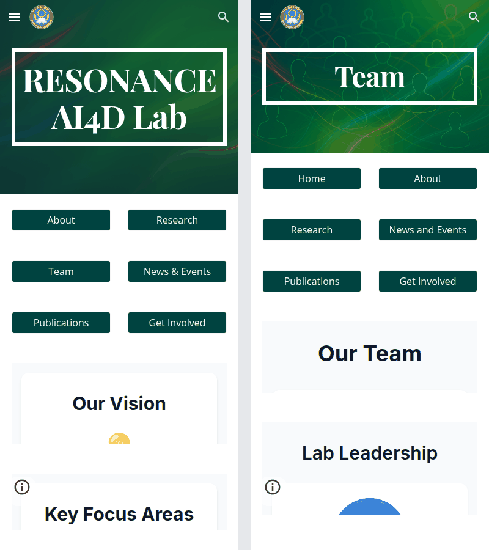 Home and Team at phone width: every section is cut off under its heading.</td>
<td valign="top" width="50%">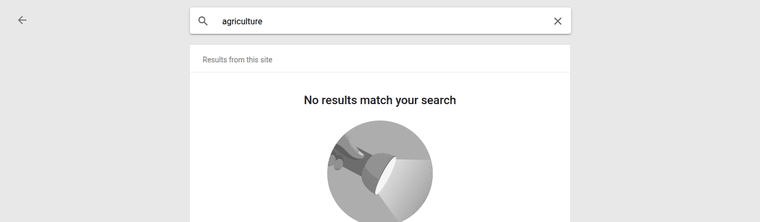 The site's own search can't find "agriculture", one of the four research themes.</td>
</tr></table>

Masakhane's site (see section 7) also runs on Google Sites, but its text is part of the page itself and reads fine on a phone. **The platform isn't the problem; the embed approach is.**

---

## 2. Out-of-date and placeholder content

Today is October 2026, and the homepage still says *"Applications for our MSc and PhD research positions are now open."* Six of the seven **News & Events → Upcoming Events** are dated July–September 2025 (the seventh is "to be announced"), and the call page's "Apply Now" still links to the 2025/26 Google Form. Several pages also publish template text:

| Where | What visitors see |
|---|---|
| Publications | Five entries reading "Title goes here / By: Author name goes here", each with a "View Details" button linking to `#` |
| Contact | Phone number `+251 XXX XXX XXXX` |
| Team | Avatars are images from an outside placeholder service (`placehold.co`); six cards read "To be recruited" |

<table><tr>
<td valign="top">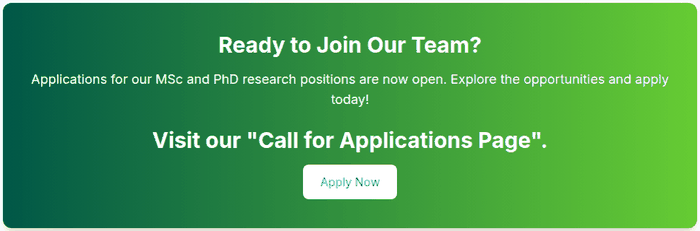 The homepage banner advertises a closed call. Its white text drops to <b>2.05 : 1</b> contrast on the lime end (4.5 : 1 is required).</td>
<td valign="top">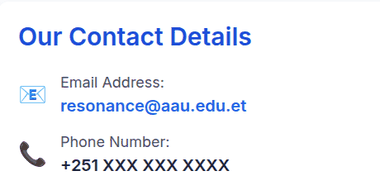 Contact page: placeholder phone number.</td>
</tr></table>

Show the Publications page placeholders

 
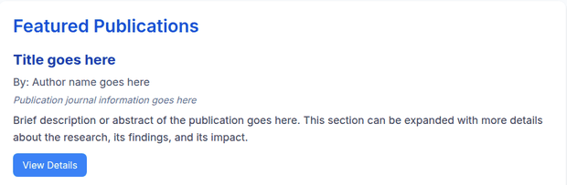

---

## 3. Header and navigation

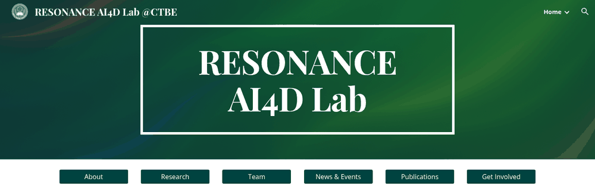

*Desktop, first screen: the long header title, a hero showing only the name in an outlined box, and the row of boxy buttons.*

- **The header title is too long.** "RESONANCE AI4D Lab @CTBE" is set in a display serif. "@CTBE" reads like a social-media handle, and neither "AI4D" nor "CTBE" is explained anywhere on the homepage. The emblem beside it is the Addis Ababa University seal; the lab has no mark of its own.
- **The real menu is hidden.** Every page is nested *under* Home, so the desktop top bar shows a single "Home ▾" dropdown and URLs look like `/home/about`. The row of buttons is a workaround for this.
- **The button rows are boxy and inconsistent.** They are six identical dark blocks with small text. Each page leaves itself out, so the buttons shift position from page to page. The labels vary ("News & Events" on one page, "News and Events" on another). **Contact appears in none of them.** Nothing marks the current page.
- **The hero takes space without giving information.** It is about 385 px tall on desktop with only the name in it. On a phone the first screen holds the seal, the name, six buttons and the clipped heading of the first section.

---

## 4. Visual design and typography

<table><tr>
<td valign="top" width="50%">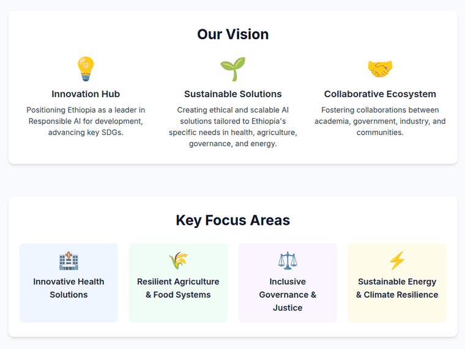 Emoji used as icons on the homepage.</td>
<td valign="top" width="50%">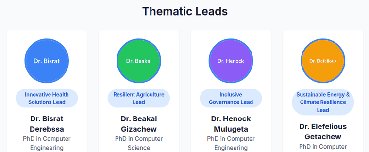 Placeholder avatars in four unrelated colours, with names written inside and shrunk to fit ("Dr. Elefelious").</td>
</tr></table>

- **Emoji icons** look different on Windows, Android and iOS. Screen readers read them aloud ("light bulb", "seedling"). Next to a university seal they look informal.
- **Five font families on one page:** Roboto, Google Sans, Playfair Display, Open Sans and Inter. The header uses a serif, the buttons Open Sans, and the content Inter.
- **Off-brand colours.** The brand is a dark green (`#005747`) that works well: white text on it reaches 8.6 : 1. The embeds add Tailwind's default blue for headings and buttons, purple and orange avatars, and a lime gradient.
- **Cards inside cards.** Content sits in a white card, inside a grey panel, inside the page. The extra frames add visual noise and narrow the text column, and the content is narrower than the button row above it.
- **Team avatars.** Each one writes "Dr. Bisrat", "Dr. Beakal" and so on in a coloured circle. Long names get squeezed, the colours carry no meaning, and the images depend on an outside placeholder service. Real photos (with consent) or two-letter initials in one brand colour would both work better.
- **The lab's name varies:** "Resonance Lab", "RESONANCE AI4D Lab", "Resonance AI4D Lab" and "RESONANCE AI4D Lab @CTBE" all appear.

---

## 5. Footer

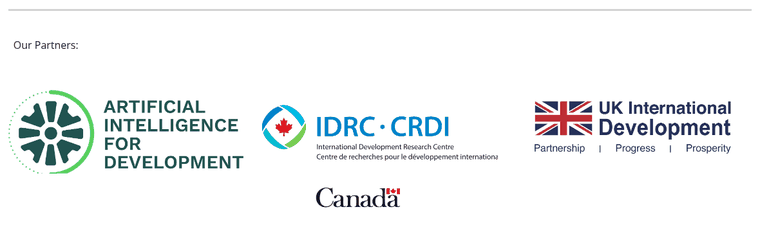

*The footer: a small "Our Partners:" label above three full-width logos of uneven visual weight, with the Canada wordmark stranded on its own line.*

The partner logos (AI4D, IDRC·CRDI with Canada, UK International Development) are shown at full column width with no alt text. On a phone they stack into roughly 600 px of logos. The footer has **no contact details, address, page links or copyright line**; the only links are Google's "Report abuse" and "Page details". Compare AI4D's own site (section 7): partner logos at a uniform small height, grouped under labels, above a compact footer with the essentials.

---

## 6. Performance

| Measurement (homepage) | Mobile | Desktop |
|---|---|---|
| Lighthouse Performance | **34** | 62 |
| Largest Contentful Paint (time until the main content appears) | **27.3 s** | 4.7 s |
| Total blocking time | 1,220 ms | 110 ms |
| Transfer size / requests | 5.6 MB / 65 | 5.6 MB / 65 |

Two images make up half the weight:

- **The hero background is a 1.7 MB PNG** (1536×1024) of an abstract green gradient. CSS could draw it at no download cost.
- **The header emblem is a 1.1 MB PNG** (959×960) shown at **56×56 px**. A 112 px WebP would weigh a few KB.

The rest is about 1.2 MB of JavaScript (mostly the Google Sites runtime, plus the Tailwind CDN) and the font files. Lighthouse's *Accessibility* score of 94 is misleading: it doesn't audit inside cross-origin iframes, so none of the embedded content was checked.

---

## 7. How similar sites do it

I compared the site with four sites that do a similar job well:
- **Makerere AI Lab** ([air.ug](https://air.ug/)): a peer African university AI lab with overlapping themes.
- **Stanford HAI** ([hai.stanford.edu](https://hai.stanford.edu/)): an academic AI institute.
- **Masakhane** ([masakhane.io](https://www.masakhane.io/)): an African AI research community, built on Google Sites.
- **AI4D Africa** ([ai4d.ai](https://www.ai4d.ai/)): the IDRC/FCDO programme whose logo appears among RESONANCE's partners.

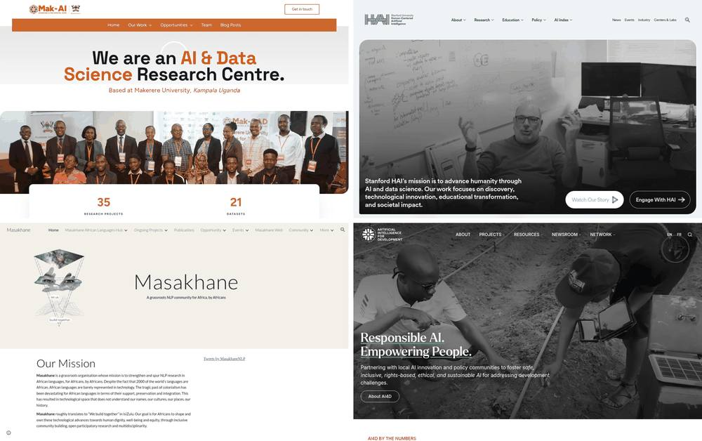

*Top left to bottom right: Makerere AI Lab, Stanford HAI, Masakhane, AI4D. Each first screen says who the organisation is in a single line.*

| Pattern on the reference sites | RESONANCE today | Take-away |
|---|---|---|
| One line saying who and where: *"We are an AI & Data Science Research Centre. Based at Makerere University, Kampala"* | Name only; AAU appears only as a seal | Lead with the full name, the mission and "Addis Ababa University" |
| A single row of text links, with dropdowns where needed (all four) | Hidden dropdown plus a boxy button row | One text navigation, current page marked |
| Compact logo with a small stacked descriptor (HAI, AI4D) | Seal plus a long serif title | Short wordmark with "AI4D Lab · Addis Ababa University" set small |
| SVG line icons (20–61 inline SVGs per homepage) | Emoji | Simple inline SVG icons in brand colours |
| 1–2 font families (Makerere: Figtree + Space Grotesk; AI4D: Inter + a serif) | 5 families | One serif for headings, one sans-serif for text |
| Compact footer with contact and links; logos at equal height (AI4D) | Logo wall, no contact | A footer with address, email, links and small labelled logos |
| A dated news item on the homepage (HAI) | Outdated "now open" banner | Show what's current, with real dates and the call's status |
| Photos of real people (Makerere, AI4D) | Placeholder avatars | Use real photos when the lab has them; until then, honest initials, never stock photos |

Weight isn't consistently better: Makerere's homepage is 8 MB, but AI4D's is under 1 MB. The take-aways here are about structure and visual patterns, not page weight.

Show the Makerere and AI4D footers

 
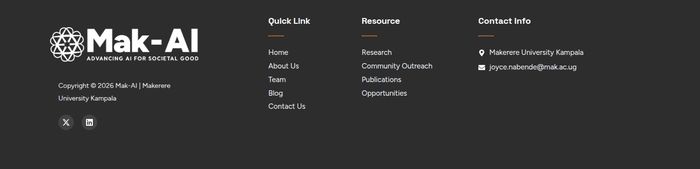
  
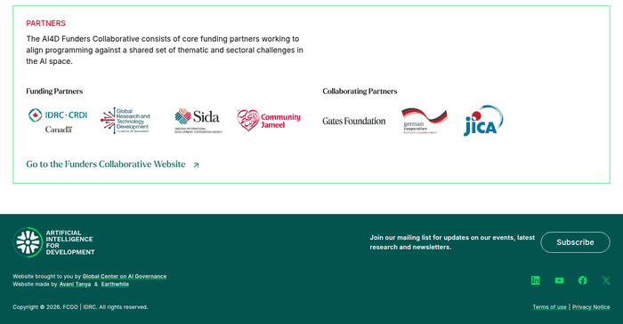

---

## 8. Accessibility checklist (manual)

| Issue | Where | WCAG |
|---|---|---|
| Partner logos have no alt text | Homepage footer | 1.1.1 |
| White text on lime gradient at 2.05 : 1 | Homepage "Ready to join" banner | 1.4.3 |
| Emoji used as icons are read aloud | All embeds | 1.1.1 |
| Each iframe is announced as "Custom embed" | Every page | 4.1.2 |
| Headings broken up across iframes (H1, then H3–H5 in separate documents) | Every page | 1.3.1 |
| Content cut off at narrow widths | Every page | 1.4.10 Reflow |
| Link text "View Details" points to `#` | Publications | 2.4.4 |

---

## 9. Prioritised recommendations

**P0: fix first.** These block the site's basic job.

| # | Recommendation | Fixes | Effort | In prototype |
|---|---|---|---|---|
| 1 | Move content out of Custom embeds into real page content (native Google Sites blocks, or a small static site) | Mobile clipping, search, accessibility, weight | Medium | **Yes** (static page) |
| 2 | Remove or correct out-of-date and placeholder content: mark the 2025/26 call as closed, hide Publications until real entries exist, remove or fill in the phone number | Credibility | Low | **Yes** for the homepage; the rest is for content owners |
| 3 | Make the first screen say who, what and where: the full name and its meaning, Addis Ababa University / CTBE, and the mission | Clarity | Low | **Yes** |

**P1: next.** These raise quality noticeably.

| # | Recommendation | Fixes | Effort | In prototype |
|---|---|---|---|---|
| 4 | One flat navigation: pages not nested under Home, text links with consistent labels, Contact included, current page marked, a proper menu on phones | Navigation | Low | **Yes** |
| 5 | A small visual system: two typefaces, the brand-green palette, SVG icons instead of emoji, one card style | Visual design | Medium | **Yes** |
| 6 | A compact footer with contact details, address, links, and partner logos at equal height with alt text | Footer, accessibility | Low | **Yes** |
| 7 | Right-size images: a CSS gradient instead of the 1.7 MB hero, the seal at 2× display size | Performance | Low | **Yes** |
| 8 | Accessibility basics: contrast, alt text, visible focus, skip link, one heading outline, descriptive page titles and descriptions | Accessibility, findability | Low | **Yes** |

**P2: later.** These need input or assets from the lab.

| # | Recommendation | Fixes | In prototype |
|---|---|---|---|
| 9 | Real team photos (with consent); until then, initials in one brand colour | Team credibility | Initials only, on the homepage |
| 10 | A RESONANCE wordmark or logo used alongside the AAU seal | Identity | Text wordmark only |
| 11 | Content ownership: a named owner and review date for News & Events and the call | Staleness | No; documented |
| 12 | A copy-editing pass: one name for the lab ("RESONANCE AI4D Lab"), fix small errors (e.g., "an Masters position"), and align the Masters entry requirement (Get Involved says "MSc or equivalent", the call says "BSc, min CGPA 3") | Clarity | Consistent naming on the homepage |
| 13 | A real publications list (or links to Google Scholar profiles) once papers exist | Credibility | No |

The prototype covers recommendations 1, 3–8 and the homepage parts of 2, 9 and 12. Everything else depends on information or assets only the lab can supply.
