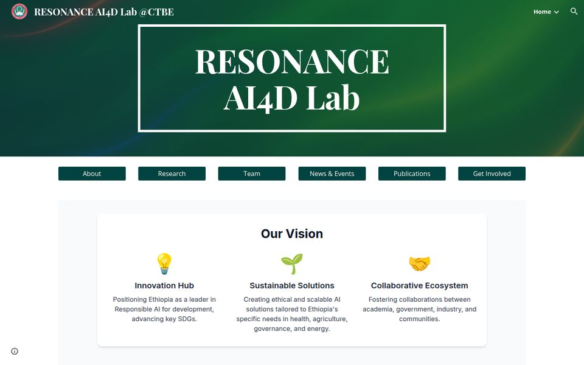
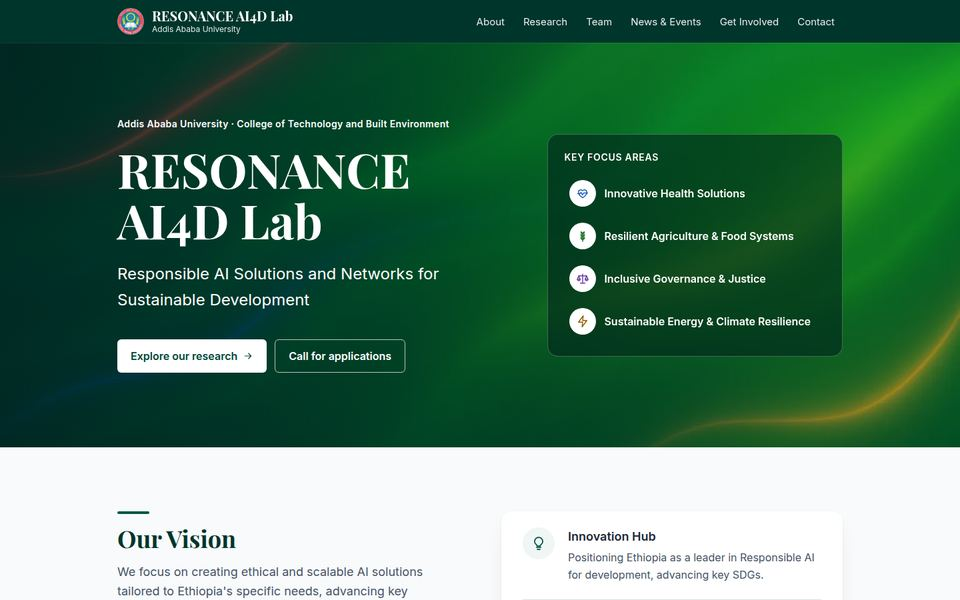
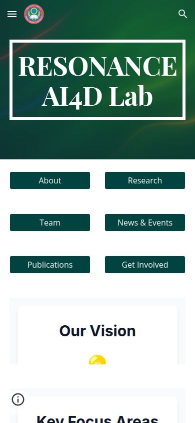
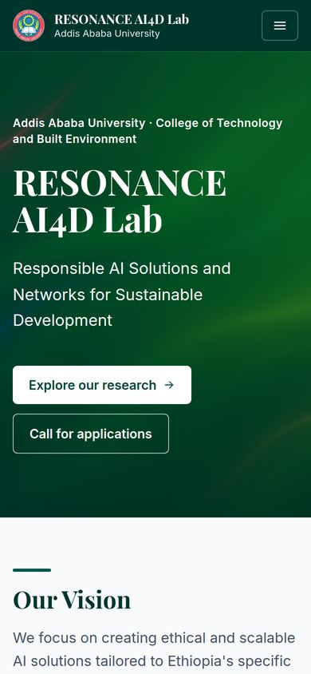
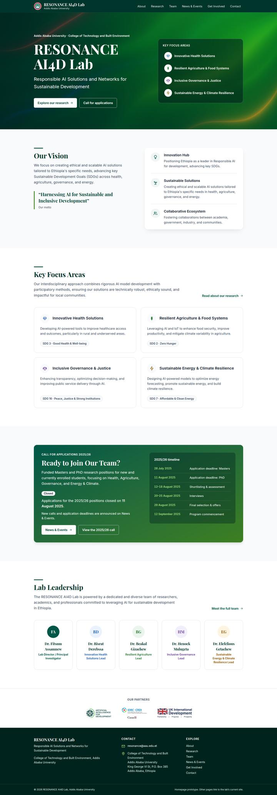

# RESONANCE AI4D Lab: homepage redesign

A review of the [RESONANCE AI4D Lab website](https://sites.google.com/aait.edu.et/resonance-lab/home) (Addis Ababa University) and an improved homepage prototype that keeps the lab's identity while fixing what is wrong underneath.

| Deliverable | Where |
|---|---|
| Brief assessment and prioritised recommendations (2 pages) | [ASSESSMENT-BRIEF.pdf](ASSESSMENT-BRIEF.pdf) |
| Full assessment with evidence, measurements and benchmarks | [ASSESSMENT.md](ASSESSMENT.md) |
| Homepage prototype (Next.js, static export) | [src/](src/) · run it with the steps below |
| Design and technical decisions, limitations, time, AI disclosure | This README |

<table><tr>
<td valign="top" width="50%"><b>Current site</b><br></td>
<td valign="top" width="50%"><b>Prototype</b><br></td>
</tr><tr>
<td valign="top"><br><sub>On a phone the current site cuts every section off under its heading.</sub></td>
<td valign="top"><br><sub>The prototype reflows to any width from 320 px up.</sub></td>
</tr></table>

<details><summary>Show the full prototype page (desktop)</summary>
<br>

</details>

---

## Run it locally

Requires **Node.js 20.9 or newer** (tested with Node 22.12) and npm.

```bash
npm install
npm run dev            # development server at http://localhost:3000
```

To build the production version, which is plain static files in `out/`:

```bash
npm run build          # static export to out/
npx serve out          # serve it at http://localhost:3000 (gzip on, like a real host)
```

`out/` must be served over HTTP. Opening `out/index.html` straight from disk won't load its assets. `npm run lint` runs ESLint.

---

## Assessment in brief

The full version, with screenshots, is in [ASSESSMENT.md](ASSESSMENT.md). The two-page summary is [ASSESSMENT-BRIEF.pdf](ASSESSMENT-BRIEF.pdf).

The lab's content is strong, but **every section of the current site is a Google Sites "Custom embed" iframe**. That one choice causes most of the problems:
- On phones, the iframes cut everything off below their headings.
- The site's own search finds nothing (try "agriculture").
- Each embed loads Tailwind's development CDN.

On top of that, the homepage still says applications "are now open" for a call that closed in August 2025, and other pages show placeholder text.

| # | Issue (most critical first) | Severity | Addressed in prototype |
|---|---|---|---|
| 1 | Content cut off on phones (fixed-ratio iframes) | Critical | Yes |
| 2 | Outdated and placeholder content | Critical | Homepage parts |
| 3 | Very slow: 5.6 MB, 65 requests, 27 s until the main content shows on mobile | Critical | Yes |
| 4 | Homepage doesn't say who the lab is or where | High | Yes |
| 5 | Navigation hidden under "Home ▾", plus inconsistent button rows | High | Yes |
| 6 | Invisible to search (site search and search engines) | High | Yes |
| 7 | Accessibility barriers (alt text, 2:1 contrast, emoji, iframe titles) | High | Yes |
| 8–13 | Emoji icons, five typefaces, off-brand colours, long header title, oversized footer, placeholder avatars | Medium | Yes |
| 14 | Inconsistent naming and copy | Low | Homepage parts |

---

## What the prototype changes

| Homepage, mobile (Lighthouse 12, simulated slow 4G) | Current site | Prototype |
|---|---|---|
| Performance / Accessibility / Best practices / SEO | 34 / 94\* / 79 / 83 | **95 / 100 / 100 / 100** |
| Largest Contentful Paint | 27.3 s | **2.7 s** |
| Page weight / requests | 5.6 MB / 65 | **266 KB / 18** |
| axe-core violations (WCAG 2.2 AA) | not measurable inside the iframes | **0** |

\* Lighthouse can't audit inside the current site's cross-origin iframes, so its 94 overstates the real accessibility.
Desktop prototype: **100 / 100 / 100 / 100**, with the main content visible in 0.6 s. The prototype was served with gzip (`npx serve out`), as any real host would serve it.

---

## Design decisions

**Evolve the lab's identity rather than replace it.** My first version was a clean but generic "AI lab" page, and review showed that it no longer looked like RESONANCE. A second version copied the old site too closely. The final version keeps what visitors recognise and fixes how it is used:

- **Kept from the current site:**
  - Its green aurora hero image, recompressed from a 1.7 MB PNG to 16 KB (desktop) and 6 KB (phone) WebP.
  - The lab name in Playfair Display, and the dark brand green `#005747`.
  - The section names and their order: Our Vision → Key Focus Areas → Ready to Join Our Team? → Our Partners.
  - The theme colour-coding (health blue, agriculture green, governance purple, energy amber).
- **Typography:** five font families become two, both already used by the lab: **Playfair Display** for headings and **Inter** for text, self-hosted (about 70 KB).
- **First screen:** says who, where and what (the name, the full name, Addis Ababa University and CTBE, and the four focus areas), with two clear actions. The current hero holds only the name.
- **Navigation:** a single row of text links in the header, including Contact. That replaces the hidden "Home ▾" dropdown and the boxy button rows, which changed from page to page and never included Contact. **Publications is left out** until that page lists real publications (it currently shows "Title goes here").
- **Honest call status:** the "Ready to Join Our Team?" banner works out *Open* or *Closed* from the call's dates, in Addis Ababa time. While a call is open it shows the site's own wording and the Apply button. Today it says the 2025/26 call closed on 11 August 2025 and points to News & Events. A future call needs only its title, dates and links updated in the content file; the status then switches by itself.
- **Calm colour:** theme colours appear only as small icon accents and leadership initials, never as large tinted areas. The banner's gradient ends on a deeper green, so white text stays at 4.9:1 or more (the original lime end is 2.05:1).
- **People without fake photos:** the Director and the four thematic leads appear as equal cards with two-letter initials in their theme colour. Real photos (with consent) should replace them, and no stock images are used.
- **SVG line icons** replace the emoji: they render the same on every device and are hidden from screen readers.
- **Compact footer** with the lab's full name, email, postal address and page links. The partner logos sit above it at one small height, with alt text.
- **No invented content.** Every string comes from the live site, and [src/content/home.ts](src/content/home.ts) notes the source page for each section. The placeholder phone number is left out.

## Technical decisions

- **Next.js 16 (App Router) + TypeScript + Tailwind CSS 4.** The stack was chosen because the lab may add a CMS and an admin area later, and Next.js covers both. The homepage itself is a **static export** (`output: "export"`): pre-rendered HTML that any static host or university server can serve.
  - Trade-off: the page still ships about 140 KB of compressed JavaScript, mostly the React runtime. A plain HTML page would be lighter, but performance still scores in the 90s on mobile.
- **A content layer ready for a CMS.** All homepage text is typed data ([src/content/types.ts](src/content/types.ts), [src/content/home.ts](src/content/home.ts)) behind one async function, `getHomeContent()` in [src/lib/content.ts](src/lib/content.ts). Connecting a CMS means changing that one function; the components stay as they are.
- **Little client-side JavaScript:**
  - Only two components run in the browser: the phone menu (a button with `aria-expanded` that closes on Escape) and the call status.
  - The call status uses `useSyncExternalStore`. The static HTML carries the status at build time, and the browser re-checks it against today's date during hydration, so an old build can never claim a call is open.
  - Everything else is server-rendered.
- **Assets:**
  - Fonts self-hosted with `next/font/local`.
  - Images pre-optimised as WebP at twice their display size. The AAU seal goes from 1.1 MB to 8 KB.
  - The hero uses a `srcset` with two sizes.
  - No third-party requests at all. The current homepage pulls from eight other hosts (Google services and the Tailwind CDN).
- **Accessibility:**
  - Semantic landmarks, one H1 and a clean heading outline.
  - A skip link, visible focus styles and `aria-current` on the home link.
  - Alt text on every logo, and reduced motion respected.
  - Every colour pair checked against WCAG AA. Hero text over the image was measured against the brightest pixel behind each line, at 6.4:1 or better from 320 to 1440 px.
- **Verification:**
  - ESLint and TypeScript pass.
  - axe-core: 0 violations at 390 and 1440 px.
  - No horizontal scroll at 320, 360, 390, 768, 1024 or 1440 px.
  - Call status tested with a mocked clock: open on 1 August 2025 and at 23:00 on 11 August, closed today.

## Project structure

```
src/
  app/            layout (fonts, metadata), page, global styles and design tokens, icons
  components/     Header, MobileNav, Hero, Vision, ResearchThemes, JoinBanner,
                  CallStatus, Leadership, Partners, SiteFooter, Icons, theme
  content/        typed homepage content, sourced from the live site
  lib/            getHomeContent() (CMS entry point), date helpers
public/images/    optimised hero, AAU seal and partner logos
docs/             assessment figures, PDF source (LaTeX), README screenshots
```

---

## Known limitations

- **Only the homepage is rebuilt.** The menu and the "read more" links go to the current Google Site pages, which still have the problems described in the assessment. The footer says so.
- **No real photography.** The hero uses the lab's existing abstract image, and people are shown as initials. Photos of the lab's people and work would do more than any design change.
- **Content is as published in October 2026.** The phone number, publications and the next call are missing because the live site doesn't have them. These need the lab.
- **The phone menu needs JavaScript**, though all pages are also linked in the footer. Call status is re-checked when the page loads, not while it stays open.
- **The React runtime** adds weight that a plain HTML page wouldn't have (see the technical decisions).
- **Tested in Chrome (desktop and mobile emulation) with automated tools only.** No testing on physical devices, other browsers, or with a screen reader by a real user.
- **No dark mode and no Amharic version.** Both would be worth considering for the lab's audience.
- **Logos and the AAU seal are copies of the files the lab already publishes.** They belong to their owners.
- **Lighthouse figures come from local runs with simulated throttling** and vary by a few points between runs.

## Time spent

About **3 hours**, in one session (3–4 October 2026). The breakdown comes from commit timestamps:

| Phase | Time |
|---|---|
| Reviewing the live site (all 9 pages), measuring, comparing with four similar sites, writing the assessment | ~50 min |
| Two-page PDF summary | ~15 min |
| First prototype: setup, content model, sections, checks | ~40 min |
| Design rework after review (lab identity, less crowding, calmer colour), re-checks, assessment correction | ~50 min |
| README, screenshots, clean-up, publishing | ~25 min |

## AI and development-tool disclosure

**AI.** This work was done with **Claude Code**, Anthropic's coding agent (model: Claude Opus 5.5), working in my terminal and repository.

- **The AI agent:**
  - Crawled and measured the live site, and extracted the content of its 36 embeds.
  - Ran Lighthouse, axe-core and the screenshot comparisons, and found the benchmark sites.
  - Drafted the assessment, the PDF and this README.
  - Wrote the code and ran the checks described above.
  - Made the commits, which carry a `Co-Authored-By: Claude` trailer.
- **I:**
  - Set the step-by-step process.
  - Added issues to the assessment (emoji icons, boxy navigation, oversized footer, inconsistent fonts, the long header title, load time, the team avatars) and asked for the comparison with similar sites.
  - Chose the stack (Next.js and Tailwind, for a future CMS and admin area), the typefaces and the team display.
  - Reviewed every iteration and directed the changes: from generic, to a copy of the old site, to the final middle ground; less crowding; the Director in the same row as the leads; no outline box; calmer focus-area colours.
- **Errors were caught and corrected:** for example, the AI-drafted assessment first called the avatar colours "unrelated". Revisiting the site's identity after my design feedback showed that they follow the theme coding, and the assessment and PDF were corrected in a separate commit.

**Development tools:**
- Node.js 22, Next.js 16.3, React 19.2, TypeScript 5, Tailwind CSS 4, ESLint 9.
- Playwright (`playwright-core` with Google Chrome) for screenshots and measurements.
- Lighthouse 12 and axe-core 4.
- Pillow and ImageMagick for image optimisation.
- LuaLaTeX for the PDF.
- Fontsource packages as the source of the font files (SIL Open Font License, licences in [src/app/fonts/](src/app/fonts/)).
- GitHub CLI.

All icons were drawn for this project.
